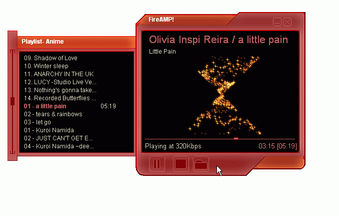



## FireAMP\! 2\.0

### Description

Here's version 2.0 of my previous submission. New features: Plugin based visualizations, Mass ID3 1.x tag editor, view clip properties.

Be sure to read the readme file
 
### More Info
 

             |
---                |---
**Submitted On**   |2007-06-12 19:38:44
**By**             |[\[HalfDemon\]](https://github.com/Planet-Source-Code/PSCIndex/blob/master/ByAuthor/halfdemon.md)
**Level**          |Advanced
**User Rating**    |5.0 (10 globes from 2 users)
**Compatibility**  |VB 6\.0
**Category**       |[Sound/MP3](https://github.com/Planet-Source-Code/PSCIndex/blob/master/ByCategory/sound-mp3__1-45.md)
**World**          |[Visual Basic](https://github.com/Planet-Source-Code/PSCIndex/blob/master/ByWorld/visual-basic.md)
**Archive File**   |[FireAMP\!\_22070566132007\.zip](https://github.com/Planet-Source-Code/halfdemon-fireamp-2-0__1-68801/archive/master.zip)

